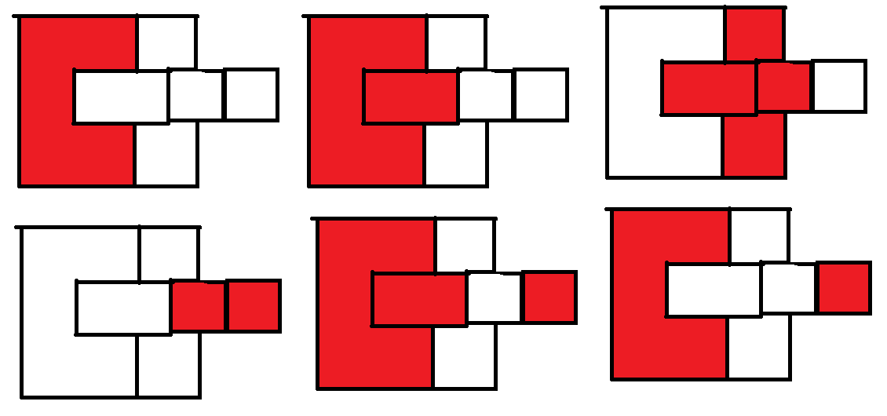
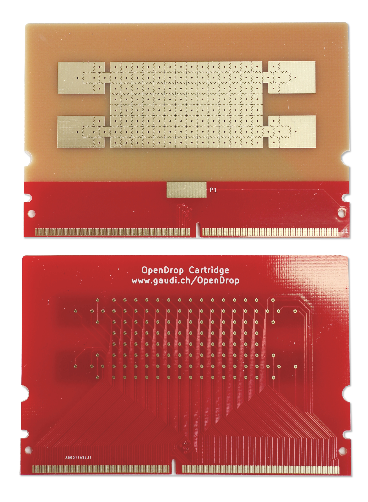

# Projects for Steve Mould's OpenDrop

[(For context see this video)](https://www.youtube.com/watch?v=rf-efIZI_Dg)

This repository contains my struggles to parse the control protocol of the [OpenDrop V4 device](https://gaudishop.ch/index.php/product-category/opendrop/) from the source code of the official OpenDrop controller found in [this repository](https://github.com/GaudiLabs/OpenDrop) ("OpenDropController4_25" folder as of writing)

## Current findings:

### Drop dispense sequence:

The official controller includes a drop dispensing sequence, what follows is a sketch of this sequence:



## Serial protocol:

The serial protocol seems to consist of sending an array of 128 bits for the display channels followed by 2 bytes of so-called _control lines_. This is achieved in the official controller by sending a serialized version of the `fluxels` array for a given frame. Not sure what these control lines actually control.

```java
int fluxel_number = 128+16; // fluexel array plus two control lines
boolean[][] fluxels = new boolean[fluxel_number][max_frame_no+1];
```

What follows is the _control_data_, first 14 control bytes are sent, afterwards 24 control bytes are supposedly read (although as of writing, the official controller seems to have a bug causing it to only read 16 of these bytes (might be intentional idk)).

```java
int[] control_data_in = new int[24];
int[] control_data_out = new int[14];
```

Note: before transmitting, the official controller discards all incoming serial data (might contain unused data?), seems useful to ensure alignment of incoming data stays in sync with the device.

## control_data

Array of (user-defined?) values, containing seemingly useful data. Currently seems to only be used to read and control temperature of [the heated cartridge](https://gaudishop.ch/index.php/product/opendrop-v4-cartridge-heated-pads/).

### control_data_out

14 bytes:

- [8] = Set temp of zone 1
- [9] = Set temp of zone 2
- [10] = Set temp of zone 3

```java
control_data_out[8] = (int) setTemperature1;
control_data_out[9] = (int) setTemperature2;
control_data_out[10] = (int) setTemperature3;
```

### control_data_in

24 bytes:

- [17-18] = Current temperature of zone 1
- [19-20] = Current temperature of zone 2
- [21-22] = Current temperature of zone 3

```java
Temperature1 = (float) control_data_in[17] / 100 + control_data_in[18];
Temperature2 = (float) control_data_in[19] / 100 + control_data_in[20];
Temperature3 = (float) control_data_in[21] / 100 + control_data_in[22];
```

## Electrode configuration

The "standard" configuration of the electrodes seems to use 4 channels for the "reservoirs", with two electrodes connected to the same channel (seen below). The main area consists of 8\*14 electrodes, connected from left to right, top to bottom, one column at a time. In other words, the order is (0, 0), (0, 1), ... (0, 7), (1, 0), (1, 1), ... (13, 7).


The channel order of the cartridge is as follows:

- Top left reservoir (4 channels)
  1.  Square
  2.  Colon
  3.  Rectangle
  4.  Big C shape
- Bottom left reservoir (4 channels) (note: reverse order)
  1.  Big C shape
  2.  Rectangle
  3.  Colon
  4.  Square
- Main area (112 channels)
- Top right reservoir (4 channels)
  1.  Square
  2.  Colon
  3.  Rectangle
  4.  Big C shape
- Bottom right reservoir (4 channels) (note: reverse order)
  1.  Big C shape
  2.  Rectangle
  3.  Colon
  4.  Square


